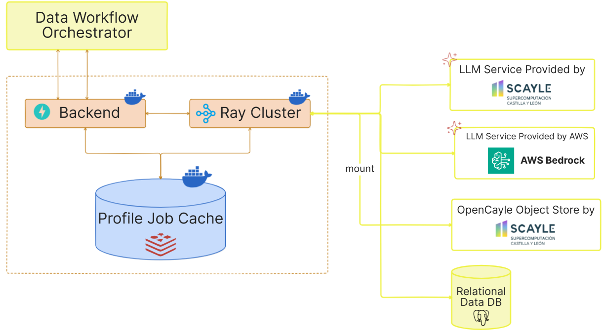

# Service Architecture

The Dataset Profiler service is designed with a microservice architecture that enables efficient and scalable dataset profiling. This document outlines the key components and their interactions.

## High-Level Architecture

The following diagram illustrates the high-level architecture of the Dataset Profiler service:

## Component Details

### API Layer

The Backend layer is built using FastAPI and provides the endpoints documented in [API Documentation](openapi.md).

Concerning profiling specifically the following endpoints are used:

- `/profiler/trigger_profile`: Submit a new profiling job
- `/profiler/runner_status/{profile_job_id}`: Check the status of the Ray task
- `/profiler/job_status/{profile_job_id}`: Check the status of the profiling job
- `/profiler/profile/{profile_job_id}`: Retrieve the generated profile
- `/profiler/cdd_profile_path/{dataset_id}`: Retrieve the CDD profile path by dataset ID
- `/profiler/clean_up`: Clean up resources for a completed job

Health and readiness are exposed separately under the `/monitoring` prefix (`/monitoring/ready`, `/monitoring/health-check`) plus the root liveness endpoint `/`.

### Job Manager

The Job Manager is responsible for:

- Creating unique job IDs for profiling requests
- Submitting jobs to the Ray cluster
- Tracking job status (submitting, starting, light profile ready, heavy profiles ready)
- Storing and retrieving job results

### Profiling Engine

The Profiling Engine performs the actual dataset analysis and consists of:

- **Dataset Specification Parser**: Parses and validates input specifications
- **Distribution Extractor**: Identifies and extracts metadata about dataset files
- **Record Set Extractor**: Analyzes the structure and content of datasets
- **Data Quality Detector** (opt-in): LLM-assisted error detection for tabular record sets — see [Data Quality](data-quality.md)
- **Profile Generator**: Assembles the extracted information into standardized profiles

### Supported Data Types

The service can profile the following types of data:

- **Tabular Data**: CSV files, Excel spreadsheets
- **Databases**: SQL databases with table structures
- **Documents**: Text files, PDF documents
- **File Collections**: Sets of related files

### Character Encoding

Uploaded files carry no reliable encoding declaration, so the profiler resolves one per file before
reading it. The candidates are tried in order and the first that decodes the file **in full** wins:

| Order | Encoding | Why |
|-------|----------|-----|
| 1 | `utf-8-sig` | Plain UTF-8, but strips a leading byte-order mark that would otherwise appear as `` welded onto the first column name |
| 2 | `cp1252` | Most files that fail UTF-8 are Windows/Excel exports. Agrees with Latin-1 except across `0x80`–`0x9F`, where it yields the intended punctuation (en-dashes, curly quotes) instead of unusable control characters |
| 3 | `ISO-8859-1` | Maps every byte `0x00`–`0xFF`, so it never raises. The last resort, and the reason profiling cannot fail on an undecodable file |

The check decodes the whole file rather than sampling a prefix. A prefix is cheaper but can be
wrong in the worst way: a file that is ASCII for its first few megabytes and Windows-encoded
afterwards would be declared UTF-8, and the decode would then fail part-way through a profiling
pass. Decoding is incremental, so memory stays flat regardless of file size, and the scan costs a
fraction of the pandas passes that follow.

The resolved encoding is reused by every reader for that file — delimiter sniffing, the header
read, both streaming passes, the semantic-type sample, and the data quality detection script — so a
file is never read two different ways.

Text and PDF record sets detect their own encoding separately, via `chardet`.

### Distributed Computing Layer

The service uses Ray for distributed computing, which enables:

- Parallel processing of multiple profiling processes
- Efficient resource utilization
- Fault tolerance and automatic recovery

### Profile Job Cache

The profile job cache handles:

- Job status monitoring
- The generated profiles

Both are stored into Redis and are retrievable through the job ID.

## Data Flow

1. Client submits a profiling request with dataset specifications
2. API validates the request and creates a job
3. Job Manager submits the job to the Ray cluster
4. Profiling Engine extracts distributions (light profile)
5. Light profile is stored and made available
6. If requested, Profiling Engine extracts record sets (heavy profile)
7. Complete profile is stored and made available to the client
